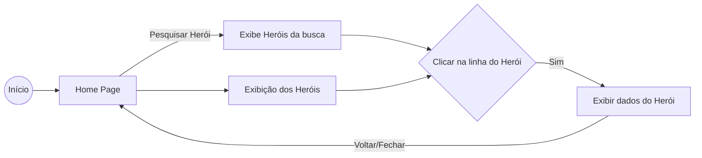

# Projeto de Heróis da Marvel - Atividade Técnica - Mobile Flutter.

Projeto de busca e exibição de heróis da Marvel, utilizando a API do site https://developer.marvel.com/

# Dados do autor do código:

Otávio Thadeu Franklin da Cunha

## Requisitos:
<ol>
    <li>- [x] Utilizar a Marvel Api: https://developer.marvel.com/​</li>
    <li>- [x] Listagem dos super-heróis limitados à 4 itens por página.</li>
    <li>- [x] Deve ser possível filtrar os personagens por nome</li>
    <li>- [x] Paginação conforme número de super heróis</li>
</ol>

## Plus:

<ol>
    <li>- [x] Criação de uma tela de detalhes do super herói​</li>
</ol>

## Fluxograma:

### Minhas redes sociais, conecte-se comigo:

### Um pouco do meu GitHub:

